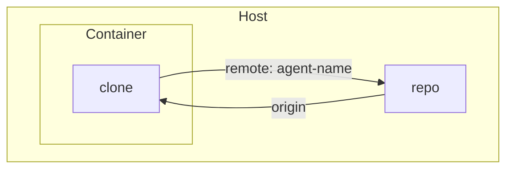
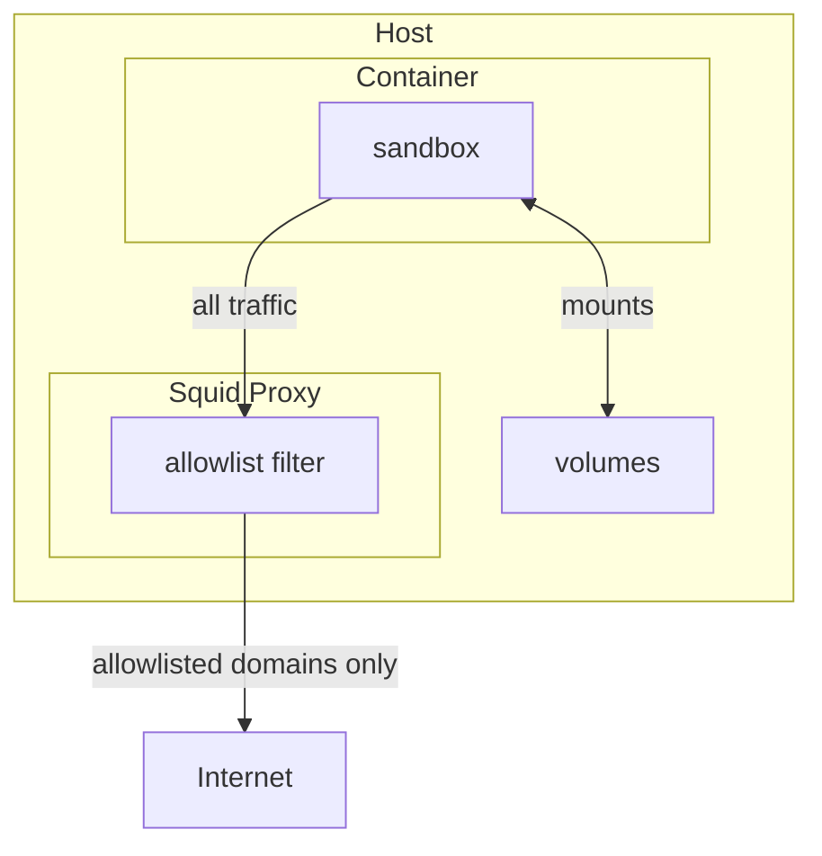

# sandbox
THIS IS A WORK IN PROGRESS. USE AT YOUR OWN RISK.

Dev sandbox container manager (podman/docker).

Give an LLM agent a clean, isolated environment to work in — your repo is configured as a read-only remote for the agent, internet access is controlled via an allowlist, and state can be persisted across restarts via mounts.

Minimal internet access is a first-class use case: dependencies can be supplied by updating the Dockerfile and restarting the container.

## Install
```bash
uv tool install git+https://github.com/eeroel/sandbox
```

Then use `sandbox` as a command from anywhere.

To update:
```bash
uv tool upgrade sandbox
```

## Usage

Initialise a template in your repo:
```bash
cd my-project
sandbox init                  # uses default template
```

This creates `.sandbox-template/` in your current directory. Commit it to your repo.

Then:
```bash
sandbox up        # provision and start — picks up .sandbox-template automatically if present in cwd
sandbox restart   # rebuild image from seeded files and restart
sandbox replace   # re-seed from template, rebuild, restart (keeps volumes and workspace)
sandbox down
sandbox exec
```

Any state that needs to survive a `sandbox down` / `sandbox up` cycle (databases, caches, build artifacts) must be covered by a mount. Configure `mounts` in `.sandbox-template/config.json` to map directories inside the container to persistent storage on the host.

## Dependencies

The build context for `docker build` is the seeded `image/` directory — not the repo root. This means live changes to your repo never affect the image. To pull specific files from your repo into the image (e.g. `requirements.txt`), list them under `inject` in `config.json`:

```json
{
  "mounts": { "foo/": "/root/foo" },
  "inject": ["requirements.txt"]
}
```

Injected files are copied from the repo into `image/` at `sandbox up` (first time) and `sandbox replace`. The Dockerfile can then `COPY` them as normal. To update the sandbox's deps to match your current repo, run `sandbox replace`.

## How it works

### Git

The repo is cloned into the container on first start and persists across restarts. Your repo is the origin for this clone, and the clone is added back as a remote (named `agent-<n>`) on your host repo, so you can fetch any changes the agent makes with `git fetch agent-<n>`. The repo's `.git` directory is mounted read-only so the container always has access to the current repo state.



### Networking

All outbound traffic from the container is routed through a per-sandbox Squid proxy. Only domains listed in `.sandbox-template/allowlist.txt` are allowed through — everything else is blocked. This lets you give the agent internet access in a controlled way. Host volumes are mounted directly and bypass the proxy.



# User stories

| State | Command |
|---|---|
| First time setup | `sandbox up` |
| Day-to-day restart | `sandbox restart` |
| User wants to pull new deps/files from repo | `sandbox replace` |
| Repo switches `requirements.txt` → `pyproject.toml` | `sandbox replace` |
| Agent edits deps | No effect |
| User adds dep agent shouldn't have | No effect unless `sandbox replace` |
| User edits seeded Dockerfile directly | `sandbox restart` — Docker cache invalidates from changed layer |
| User edits `.sandbox-template/Dockerfile` in repo | No effect unless `sandbox replace` |

## Known edge cases

| Case | Fixed |
|---|---|
| Manual Dockerfile edits silently lost on `replace` | ✗ — needs warning prompt |
| `inject` entry points to a directory | ✗ — needs `is_file()` guard |
| Inject file renamed in repo — seeded config still points to old name | by design — user updates template |
| Inject filename must match what Dockerfile expects | by design — user's responsibility |
| Must run from repo root to find `.sandbox-template` | by design — consistent with Docker etc. |
| Two sandboxes from same repo with divergent deps | out of scope |