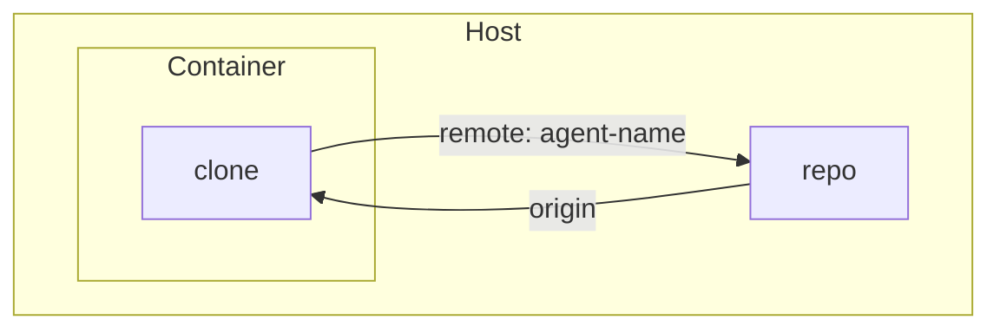
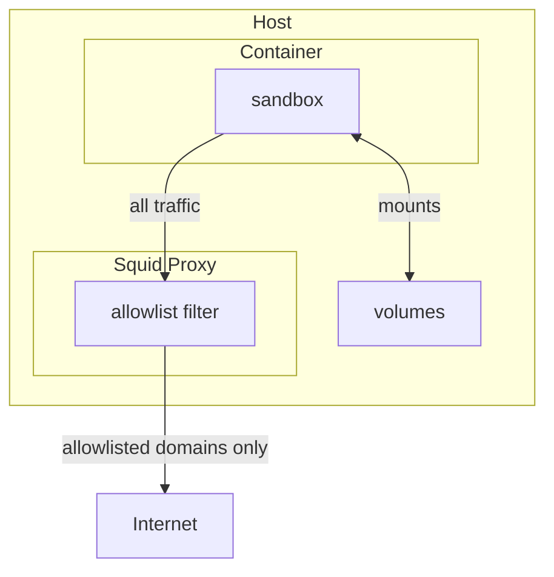

# sandbox
THIS IS A WORK IN PROGRESS. USE AT YOUR OWN RISK.

Dev sandbox container manager (podman/docker, docker-compose-free).

## Install
```bash
uv tool install git+https://github.com/eeroel/sandbox
```

Then use `sandbox` as a command from anywhere.

To update:
```bash
uv tool upgrade sandbox
```

## Usage

Initialise a profile in your repo:
```bash
cd my-project
sandbox init                  # uses default profile
```

This creates `.sandbox-profile/` in your current directory. Commit it to your repo.

The build context is your repo root, so if your repo is large, add a `.dockerignore` before running `sandbox up` to avoid sending unnecessary files to the Docker daemon on every build. A minimal example:

```
*
!requirements.txt
!uv.lock
!pyproject.toml
```

Then:
```bash
sandbox up        # picks up .sandbox-profile automatically if present in cwd
sandbox down
sandbox exec
```

If dependencies have changed, run `sandbox up` again — Docker's layer cache handles the rest. Use `sandbox up --no-cache` for a full rebuild.

Any state that needs to survive a `sandbox down` / `sandbox up` cycle (databases, caches, build artifacts) must be covered by a mount. Configure `mounts` in `.sandbox-profile/config.json` to map additional directories inside the container to persistent storage on the host.

## How it works

### Git

The repo is cloned into the container on first start and persists across restarts. Your repo is the origin for this clone, and the clone is added back as a remote (named `agent-<n>`) on your host repo, so you can fetch any changes the agent makes with `git fetch agent-<n>`. The repo's `.git` directory is mounted read-only so the container always has access to the current repo state.



### Networking

All outbound traffic from the container is routed through a per-sandbox Squid proxy. Only domains listed in `.sandbox-profile/allowlist.txt` are allowed through — everything else is blocked. This lets you give the agent internet access in a controlled way. Host volumes are mounted directly and bypass the proxy.

